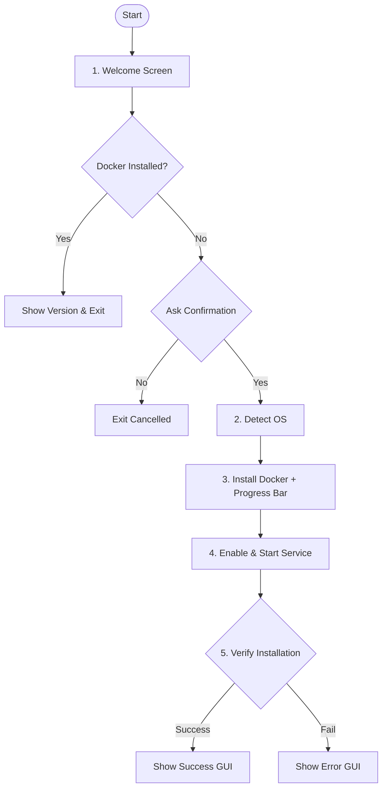
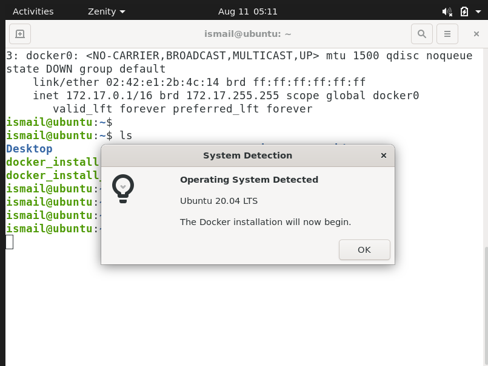
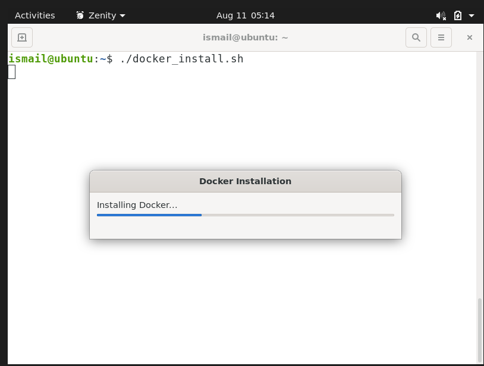
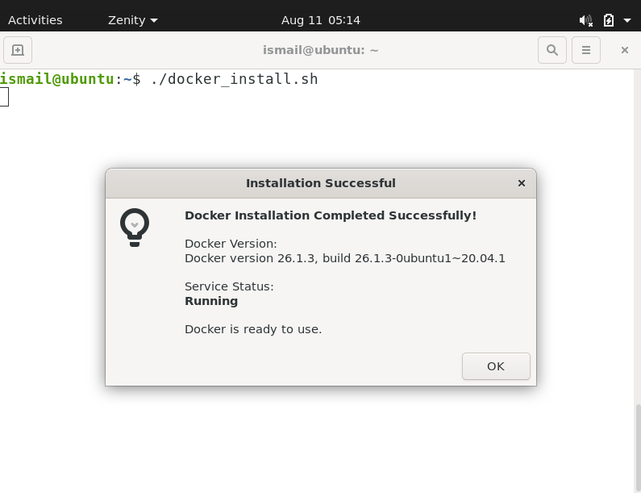
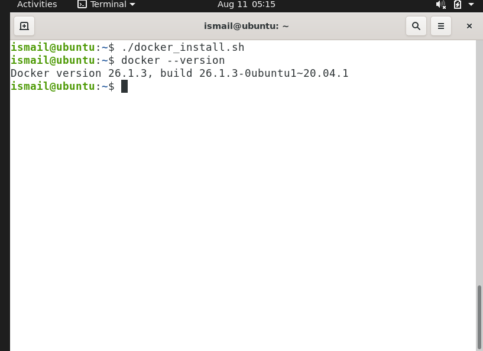

# Docker Installation Wizard (Zenity GUI)

A lightweight Bash script using **Zenity GTK GUI** to automate Docker detection, user confirmation, OS detection, installation, service management, and verification on Linux systems.

---

## 🔄 Application Flowchart



---

## 🚀 Prerequisites & Quick Start

```bash
# 1. Install Zenity (GTK GUI utility)
sudo apt update && sudo apt install -y zenity

# 2. Make script executable
chmod +x docker_install.sh

# 3. Run the wizard
./docker_install.sh
```

---

## 📜 Full Script (`docker_install.sh`)

```bash
#!/usr/bin/env bash
set -e

# 1. Check Dependency
command -v zenity &>/dev/null || { echo "Zenity required"; exit 1; }

# 2. Welcome Screen
zenity --info --title="Docker Installation Wizard" \
  --text="Welcome to Docker Installation Wizard\n\nThis wizard will check your system and install Docker if required.\n\nClick OK to continue." --width=400 || exit 0

# 3. Check if Docker is Installed
if command -v docker &>/dev/null; then
    DOCKER_VER=$(docker --version)
    zenity --info --title="Docker Already Installed" \
      --text="Docker is already installed.\n\n$DOCKER_VER\n\nNo installation is required." --width=450
    exit 0
fi

# 4. User Confirmation Prompt
zenity --question --title="Docker Installation" \
  --text="Docker was not found on this system.\n\nWould you like to install Docker now?" --width=400 || exit 0

# 5. OS Detection
. /etc/os-release 2>/dev/null || OS_NAME="Linux"
zenity --info --title="System Detection" \
  --text="Operating System Detected\n\n${PRETTY_NAME:-$OS_NAME}\n\nThe Docker installation will now begin." --width=400 || exit 0

# 6. Install Docker with Progress Bar
(
    echo "10" ; echo "# Updating package repository lists..."
    echo "40" ; echo "# Installing Docker..."
    sudo apt-get update -y >/dev/null 2>&1
    sudo apt-get install -y docker.io >/dev/null 2>&1 || sudo apt-get install -y docker-ce docker-ce-cli containerd.io >/dev/null 2>&1
    echo "80" ; echo "# Enabling & starting Docker service..."
    sudo systemctl enable --now docker >/dev/null 2>&1 || true
    echo "100" ; echo "# Installation complete!"
) | zenity --progress --title="Docker Installation" --text="Installing Docker..." --percentage=0 --auto-close --no-cancel

# 7. Verification & Status Display
if command -v docker &>/dev/null; then
    DOCKER_VER=$(docker --version)
    zenity --info --title="Installation Successful" \
      --text="Docker Installation Completed Successfully!\n\nDocker Version:\n$DOCKER_VER\n\nService Status:\nRunning\n\nDocker is ready to use." --width=450
else
    zenity --error --title="Installation Failed" --text="Docker installation failed." --width=400
fi
```

---

## 📸 Step-by-Step Execution Workflow & Screenshots

### Step 1: Welcome Screen
When `./docker_install.sh` is run, an introductory GTK dialog welcomes the user and explains what the wizard will do.


---

### Step 2: Check Docker Installation

#### Case 2A: Docker Already Installed
If Docker is detected on the system, the wizard displays the installed version and exits gracefully without making any changes.

.png)

#### Case 2B: Docker Not Found Confirmation
If Docker is not detected, the wizard prompts the user with a decision modal asking for confirmation to install.

.png)

---

### Step 3: Operating System Detection
Upon user confirmation, the script inspects `/etc/os-release` and displays the host Linux distribution.



---

### Step 4: Installation & Progress Feedback
A real-time Zenity progress bar displays visual feedback while updating packages, installing Docker, and starting `docker.service`.



---

### Step 5: Verification & Status Report

#### Success GUI Summary
After installation, the wizard verifies Docker availability and service status, showing a final success dialog.



#### Terminal Command Verification
Confirmation in terminal validating `docker --version`.


