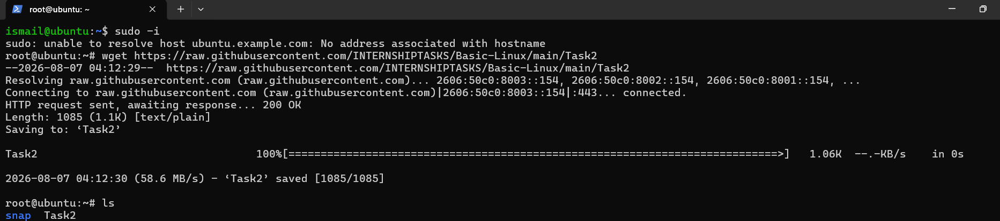
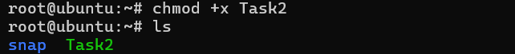
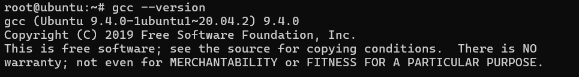
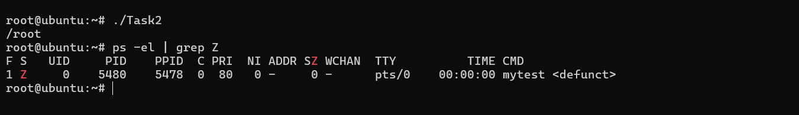
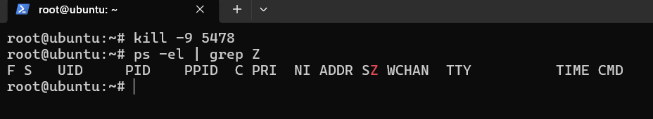

# Detailed Linux Guide: Simulating, Identifying, and Cleaning Up Zombie Processes

## 📌 Executive Summary
This document provides a detailed, step-by-step walkthrough of identifying, inspecting, and resolving **Zombie Processes** in a Linux environment (Ubuntu). It covers both the theoretical context of process state management and practical CLI commands used to manipulate and clean up defunct processes.

---

## 🧠 Theoretical Background: What is a Zombie Process?

In Linux operating systems:
- When a process terminates, it doesn't immediately vanish from the system memory process table.
- **Zombie Process Definition**: A process that has finished execution (via `exit()` syscall) but still retains an entry in the Operating System's Process Table so its parent process can read its exit status.
- **Process State Code**: Identified by **`Z`** state or **`<defunct>`** tag in process listings (`ps`, `top`).
- **Why are they harmful?**: While zombie processes do not consume CPU or RAM memory (since their memory space is released), they consume process table entries (PIDs). If the process table fills up with zombies, no new processes can be created.
- **Why can't you `kill -9 <zombie_pid>` directly?**: A zombie process is **already dead**. You cannot kill what is already dead!
- **How to remove a Zombie**:
  1. The parent process must read the child's exit status using `wait()` or `waitpid()` (Reaping).
  2. If the parent process is faulty or unresponsive, **killing the parent process (`kill -9 <parent_pid>`)** causes the zombie process to be adopted by process ID 1 (`init` or `systemd`), which automatically calls `wait()` and cleans up the zombie.

---

## 🛠 Step-by-Step Task Execution

### Step 1: Gain Superuser (Root) Privileges
Managing system processes and running kernel test tools requires administrative permissions.

```bash
sudo -i
# OR
su -
```

---

### Step 2: Download the Task Script / Binary
Download the script designed to simulate a zombie process scenario from the repository using `wget`:

```bash
wget https://raw.githubusercontent.com/INTERNSHIPTASKS/Basic-Linux/main/Task2
```



*Explanation*: The command fetches the `Task2` file into the current working directory (`/root`).

---

### Step 3: Make the Script Executable
By default, downloaded files do not have execution permissions. Use `chmod` to grant execute permissions (`+x`):

```bash
chmod +x Task2
ls -l
```



*Explanation*: Running `chmod +x Task2` modifies the file permissions. The filename appears highlighted in green when listed with `ls`, confirming executable status.

---

### Step 4: Verify C Compiler Environment (GCC)
Verify that the GNU Compiler Collection (`gcc`) is installed on the system, as the task script compiles and spawns C-level child process binaries (`mytest`):

```bash
gcc --version
```



*Explanation*: Confirms `gcc 9.4.0` is available on the Ubuntu system.

---

### Step 5: Execute the Task & Detect the Zombie Process

Run the executable to spawn the target process, then filter active system processes for Zombie state (`Z`):

```bash
./Task2
ps -el | grep Z
```



#### Output Analysis:
```text
F S  UID   PID  PPID  C PRI  NI ADDR SZ WCHAN  TTY      TIME CMD
1 Z    0  5480  5478  0  80   0 -    0 -      pts/0 00:00:00 mytest <defunct>
```

| Field Header | Value | Meaning |
| :--- | :--- | :--- |
| **S (State)** | `Z` | Process state is **Zombie** |
| **PID** | `5480` | Process ID of the **Zombie Child Process** |
| **PPID** | `5478` | Process ID of the **Parent Process** |
| **CMD** | `mytest <defunct>` | Process command marked as defunct |

To inspect specific formatting:
```bash
ps -o pid,ppid,state,cmd -p 5480
```

---

### Step 6: Resolve & Clean Up the Zombie Process

Attempting `kill -9 5480` would fail to clear the table entry because process `5480` has already exited. 

To clean it up, kill the **Parent Process (`PPID: 5478`)** using `kill -9`:

```bash
kill -9 5478
ps -el | grep Z
```



*Explanation*: 
1. `kill -9 5478` terminates the parent process.
2. The zombie process (`5480`) becomes orphaned and is immediately adopted by `init`/`systemd` (PID 1).
3. PID 1 automatically reaps the child process by invoking `wait()`.
4. Running `ps -el | grep Z` returns no output, confirming the zombie process is completely removed from the OS process table.

---

## 📋 Command Cheat Sheet Summary

| Step | Command | Purpose |
| :--- | :--- | :--- |
| 1 | `sudo -i` | Switch to root superuser context |
| 2 | `wget https://raw.githubusercontent.com/INTERNSHIPTASKS/Basic-Linux/main/Task2` | Download task file from remote repository |
| 3 | `chmod +x Task2` | Grant execution permissions to `Task2` |
| 4 | `./Task2` | Execute the program to generate zombie process |
| 5 | `ps -el \| grep Z` | Filter process tree for Zombie (`Z`) state processes |
| 6 | `ps -o pid,ppid,state,cmd -p <zombie_pid>` | Inspect specific PID, Parent PID, state & command details |
| 7 | `kill -9 <parent_pid>` | Force kill parent process so `init` / `systemd` reaps the zombie |
| 8 | `ps -el \| grep Z` | Verify zombie process is cleared |

---
*Created as part of Linux Process Management Internship Tasks.*
